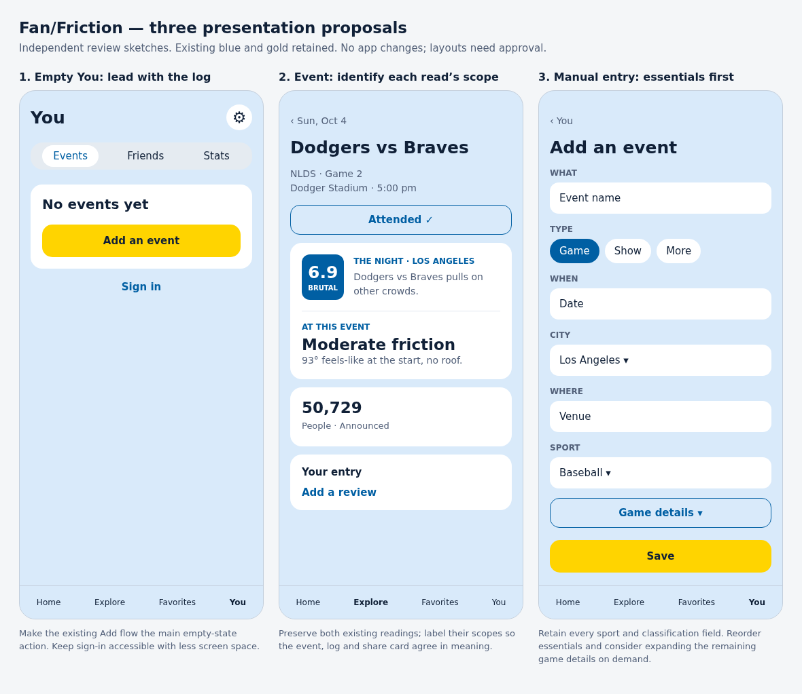

# Fan/Friction gap review by Codex — October 7, 2026 at 8:02 PM Pacific

**Author:** Codex  
**Saved:** October 7, 2026 at 8:02:51 PM PDT (UTC−07:00)  
**Status:** Open independent review; no findings or designs approved for implementation.

This review combines the implementation and data pass with the subsequent phone-sized UX/UI pass. GrokBot/Cursor’s gap review and its screenshots and mockups were not opened. The numbering distinguishes the two passes and provides stable references for later discussion.

The strongest implementation findings concern protecting the log, account sync, and historical read status. The strongest presentation findings concern hierarchy, unclear read scopes, and controls that promise more than they deliver. Findings can overlap across the two passes; this is not a count of unique build tasks.

**Review boundary:** Saving this document does not authorize implementation. Propose an approach to Kylie before building. Structural proposals require her approval; parked work stays parked unless she reopens it. Do not treat Codex’s recommendations as product decisions or rules attributed to Kylie.

## Scope and verification

Implementation review: current code, direction, handoff and backlog; TypeScript check passed. Isolated in-memory checks reproduced plan loss on lookup failure, offline-edit replacement and incorrect tied-score calculation. No live account writes were performed. Visual review: primarily 390 × 844 Chromium phone emulation, signed out with disposable local entries; public catalog reads, seeded sports and concert dates, interactive forms, and controlled public-feed failures. Signed-in account screens, physical-phone gestures, keyboards and legibility remain untested. Initial map rendering failed in the isolated browser and succeeded after adjusting its certificate handling; the initial blank map is not treated as an app defect. No app or repository-document edits were made. Other workspace changes observed during the review were left untouched. Screenshots are review-session captures, not current live-app guarantees.

Isolated in-memory checks produced these results:

| Check | Actual result | Expected behavior |
|---|---|---|
| Past plan, empty event lookup | 0 plans and 0 attended entries | Retain the unresolved plan |
| Past plan, lookup throws | 0 plans and 0 attended entries | Retain the unresolved plan |
| Newer offline review merged with older account review | Older review survives | Preserve the unsynced edit |
| Combine friction components 6, 6, 1 | 6 | 6.75 under the documented formula |

## Implementation and data findings

### D01 A saved night can disappear when its event cannot be loaded

**Classification:** Bug; high priority.

When the app converts past plans to attended entries, a failed lookup or missing event prevents entry creation, but the plan is removed anyway. Both cases were reproduced.

**Potential solution:** Remove a plan only after its attended entry exists. Retain unresolved plans for retry and preserve enough event information for a night to remain loggable when its listing disappears.

**Evidence:** [src/data/personalLog.ts:484](../../../../src/data/personalLog.ts#L484).

### D02 Two devices can overwrite each other’s logs

**Classification:** Bug; high priority.

Saving writes the device’s entire log, then deletes account entries absent from that copy. A later save from a stale phone can remove a night added on a laptop. Rapid saves on one device can also overlap. This finding was traced in code rather than reproduced against live accounts.

**Potential solution:** Save individual additions, edits and removals; handle conflicting edits explicitly and serialize saves on each device.

**Evidence:** [src/data/storage/supabaseStore.ts:133](../../../../src/data/storage/supabaseStore.ts#L133).

### D03 An offline edit can revert when the app reopens

**Classification:** Bug; high priority.

The phone retains failed saves, but on account loading the account’s version wins when both copies contain the same entry. An isolated reproduction reverted a newer offline review to the older review. The current warning is shown only in You.

**Potential solution:** Retain unsynced changes and replay them after reconnecting. Surface a short pending or failed-save status where the edit happens.

**Evidence:** [src/data/storage/index.ts:63](../../../../src/data/storage/index.ts#L63), [src/data/personalLog.ts:99](../../../../src/data/personalLog.ts#L99).

### D04 The offline cache includes private account data

**Classification:** Privacy risk to validate; high priority.

The rule described as caching the shared catalog matches every Supabase data GET, including entries, private With fields, settings and follows. Sign-out clears the ordinary phone log but not this cache. The broad rule is confirmed; cross-account disclosure was not demonstrated in a browser.

**Potential solution:** Restrict caching to explicitly public catalog tables. If private offline storage is wanted, give it account boundaries and sign-out cleanup.

**Evidence:** [vite.config.ts:64](../../../../vite.config.ts#L64).

### D05 Stamped does not reliably mean the night has locked

**Classification:** Data and presentation bug.

The date page calls today Stamped while the event page calls today Forecast. Both display freshly calculated reads rather than selecting a saved stamp. Log ratings also bypass the entry’s saved stamp.

**Potential solution:** Give all screens one shared answer for the read’s value, status and basis. Use the actual lock time and preserve the approved distinction between a saved forecast basis and a reconstructed night. Formula updates can still recalculate records under the existing decision.

**Evidence:** [src/screens/DateScreen.tsx:95](../../../../src/screens/DateScreen.tsx#L95), [src/data/read.ts:412](../../../../src/data/read.ts#L412).

### D06 Manually logged nights can miss a nearby read

**Classification:** Bug.

The score lookup loads the catalog, but the eligibility check for a small hand-entered night consults only hand-seeded events. A feed-covered date can have a read in Explore and none on the manual entry.

**Potential solution:** Check the same complete event list used to calculate the date’s read.

**Evidence:** [src/data/personalLog.ts:589](../../../../src/data/personalLog.ts#L589).

### D07 Tied friction components calculate incorrectly

**Classification:** Bug.

The combination rule removes every component tied for highest rather than removing one leading component. An isolated reproduction gave 6 for components 6, 6 and 1; the documented rule gives 6.75.

**Potential solution:** Count the other tied component normally. This corrects the existing formula without changing or tuning its weights.

**Evidence:** [src/data/formula/index.ts:40](../../../../src/data/formula/index.ts#L40).

### D08 Add-event search silently searches only home

**Classification:** Structural UX proposal.

Someone whose home is Los Angeles can receive no match for a covered New York event. There is no city selector in the search step, which can encourage manual duplicates.

**Potential solution:** Make search scope visible and changeable without changing home.

**Evidence:** [src/screens/AddEntryScreen.tsx:58](../../../../src/screens/AddEntryScreen.tsx#L58).

### D09 A manually entered date, title or venue cannot be corrected

**Classification:** Structural UX proposal.

Edit changes Review and With only. Fixing identifying details requires removing and recreating the entry.

**Potential solution:** Allow correction of identifying details on manual entries while keeping sourced event facts governed by their sources.

**Evidence:** [src/components/EntryLayer.tsx:38](../../../../src/components/EntryLayer.tsx#L38).

## UX/UI visual findings

The visual foundation is coherent: consistent cards, readable event titles, and stable navigation. The biggest problems are hierarchy, unclear meanings, and controls that promise more than they deliver.

### UX01 Different read scopes look contradictory

**Classification:** Structural.

The same event is Moderate on its page and Brutal · 6.9 in You and the share card. Different scopes are not clearly identified.

**Potential solution:** Label the readings The night and At this event. Preserve both.

**Screenshot evidence:** [event-bottom.png](assets/codex-2026-10-07-2002-pt/event-bottom.png).

### UX02 Sign-in dominates the signed-out You screen

**Classification:** Structural.

Sign-in remains prominent after a local entry is logged. The empty state points toward the map while Add is a small plus above it.

**Potential solution:** Lead the empty state with Add an event; give sign-in a smaller entry point and keep account utilities behind the gear.

**Screenshot evidence:** [you-empty.png](assets/codex-2026-10-07-2002-pt/you-empty.png).

### UX03 Upcoming rows show empty score boxes despite forecasts

**Classification:** Data/UI.

Home shows a dash for the Oct 8 Lakers game although Explore has that date’s read. Favorites has the same presentation gap.

**Potential solution:** Connect those tiles to the existing date read. Reserve the dash for genuinely unavailable readings.

**Screenshot evidence:** [home-loaded.png](assets/codex-2026-10-07-2002-pt/home-loaded.png), [favorites-populated.png](assets/codex-2026-10-07-2002-pt/favorites-populated.png).

### UX04 Quiet appears on dates with no listings

**Classification:** Data/UI.

The date strip labels dates Quiet, including dates before the archive began. It reads as a conclusion about the night.

**Potential solution:** Distinguish unknown coverage from a known quiet date; use a neutral dash for missing information.

**Screenshot evidence:** [explore-later.png](assets/codex-2026-10-07-2002-pt/explore-later.png).

### UX05 Traffic activates without traffic information

**Classification:** Structural; already parked.

Traffic removes crowd information and leaves a plain map. This can suggest clear traffic.

**Potential solution:** Keep the feature represented, but make its unfinished state explicit or disable activation until it has information to show.

**Screenshot evidence:** [traffic.png](assets/codex-2026-10-07-2002-pt/traffic.png).

### UX06 Classification precedes manual-entry essentials

**Classification:** Structural.

Sport, level, division and competition occupy most of the first screen before date and venue.

**Potential solution:** Put identifying essentials first. Keep every classification option, with secondary game details expandable.

**Screenshot evidence:** [manual-form-expanded.png](assets/codex-2026-10-07-2002-pt/manual-form-expanded.png).

### UX07 Favorites picker is long and undifferentiated

**Classification:** Structural.

Teams and venues run together; Done is below the entire list.

**Potential solution:** Group suggestions by type and keep Done accessible while scrolling. Keep search prominent.

**Screenshot evidence:** [favorites-empty.png](assets/codex-2026-10-07-2002-pt/favorites-empty.png).

### UX08 Event pages carry repeated explanations and metadata

**Classification:** Structural and polish; share design already awaiting a decision.

Type, occasion chips, formula caveats, chart instructions, source explanations and a large share preview compete with the entry.

**Potential solution:** Keep information available through detail controls and simplify the main page. Consider opening the share preview on demand.

**Screenshot evidence:** [event-bottom.png](assets/codex-2026-10-07-2002-pt/event-bottom.png).

### UX09 Estimate explanation is difficult to scan

**Classification:** Structural and polish.

Opening the card for a concert begins with regular-season games and then playoffs. The title repeats and Done sits below visible content.

**Potential solution:** Retain the single explanation card; lead with the relevant event type, shorten paragraphs and provide a visible close control.

**Screenshot evidence:** [estimate-info.png](assets/codex-2026-10-07-2002-pt/estimate-info.png).

### UX10 Stats repeats information and infers a usual night from one event

**Classification:** Data/UI and polish.

The heaviest reading repeats. One entry produces Your usual night is Brutal. The Hours tile has an unexplained trailing · 1.

**Potential solution:** Consolidate repeated statistics, describe the single entry rather than infer a usual pattern, and clarify or omit the trailing count.

**Screenshot evidence:** [you-stats.png](assets/codex-2026-10-07-2002-pt/you-stats.png).

### UX11 Loading and failure states provide little feedback

**Classification:** Structural.

Pages can remain blank while requests settle. Event not found offers only a return to the map.

**Potential solution:** Use a compact loading state, distinguish failed loading from an absent listing, offer Retry when appropriate and preserve access to saved entries.

**Screenshot evidence:** [event-failure.png](assets/codex-2026-10-07-2002-pt/event-failure.png), [event-failure-later.png](assets/codex-2026-10-07-2002-pt/event-failure-later.png).

### UX12 Some touch controls and metadata are very small

**Classification:** Polish.

Follow pills are 30 pixels tall. Chart labels and secondary metadata are small. Physical-phone legibility was not tested.

**Potential solution:** Enlarge touch areas without necessarily enlarging visible pills; check the smallest text on a physical phone.

**Screenshot evidence:** [favorites-empty.png](assets/codex-2026-10-07-2002-pt/favorites-empty.png).

## Visual proposals

Three standalone sketches cover the empty You screen, clearer read scopes, and essentials-first manual entry. They retain the existing blue and gold. Every layout remains a discussion proposal, not an approved design.

[Open the full-size sketch board](assets/codex-2026-10-07-2002-pt/proposals.png) · [Editable standalone HTML](assets/codex-2026-10-07-2002-pt/proposals.html)

## Additional screenshots

- [Event page](assets/codex-2026-10-07-2002-pt/event.png)
- [Date page](assets/codex-2026-10-07-2002-pt/date.png)
- [Populated You with a disposable local entry](assets/codex-2026-10-07-2002-pt/you-populated.png)
- [Team page](assets/codex-2026-10-07-2002-pt/team.png)
- [Bottom of the manual form](assets/codex-2026-10-07-2002-pt/manual-form-bottom.png)
- [Open month picker](assets/codex-2026-10-07-2002-pt/month-sheet-open.png)

## Suggested priority

Address log loss, sync, and cache boundaries first. Then address read clarity, missing-versus-quiet states, and the logging flow. Batch spacing, typography, and small copy fixes later. These are review recommendations; no build order is newly approved.

## Reuse in later reviews

Reference this review by its dated filename and issue identifiers. Save later gap reviews as separate dated documents rather than silently rewriting this snapshot. Compare with the other model’s review only after preserving both independent passes.

---

## Addendum: broader project-context review

**Author:** Codex  
**Appended:** October 07, 2026 at 08:32:28 PM PDT (UTC-0700)  
**Status:** Review only; no implementation approved.

Kylie requested a fuller catch-up and any resulting updates to this review. This addendum preserves the original snapshot and its issue IDs. It follows a broader reading of the product decisions, account and entry specifications, Compare proposal, catalog architecture, city checklist, attendance decisions and checks, deferred work, and tester guide. GrokBot/Cursor's gap-review document and visual assets remain unopened for this pass. Product decisions that credit its mockups were read as decisions, not as an independent review to copy.

The checkout was at `20abaa5`; Claude was actively changing other documents during this pass. These notes describe the files read, not a guarantee about the eventual build. No fresh browser screenshots or signed-in tests were taken. Original screenshots remain dated evidence.

### Clarifications and updates to existing findings

| Item | Updated assessment |
|---|---|
| **D01–D04** | The plan-removal, full-log replacement, account-wins merge and broad REST-cache patterns remain in the inspected code. Protecting saved nights remains my first recommendation. Their original verification limits still apply: this pass did not reproduce a live account collision or demonstrate private-cache disclosure. |
| **D05** | The problem is consistency of value, status and historical basis. A record need not be permanently immune to formula improvements: recalculation was explicitly allowed. Save-time forecast capture and a new half-hour job are not proposed fixes; the later decision says Save keeps no forecast, and the half-hour job stays parked. Automatic plan-to-attendance conversion is also approved; D01 concerns failed conversion losing a night, not whether automatic conversion should exist. |
| **D09** | Limit the proposal to correcting a person's manually entered identifying details. Kylie explicitly removed sourced event facts from the editing form. This recommendation does not restore typed scores, starters, promotions, TV or setlists. |
| **UX02** | A signed-out sign-in prompt is intentional, and accounts are optional. The recommendation concerns prominence and access to logging; it does not mean removing sign-in. The plus beside the gear is also an approved entry point. Making Add the main empty-state action is an alternative to propose, not correction of an unauthorized layout. |
| **UX03** | The backlog already acknowledges that upcoming team-schedule rows lack catalog reads. This is a known presentation gap, not evidence that the formula has no forecasts. |
| **UX08** | The share card serves an explicitly approved purpose at the end of the event page. Opening it only on demand would require Kylie to reopen that placement. My narrower recommendation is to improve the entry's hierarchy and consolidate repeated information while retaining the card in its current role. Kylie also explicitly liked the weather and local-competition cards; retain them. |
| **UX09** | Partly addressed in the current code: crowd-backed estimates now open with “About this estimate” and an event-specific basis and range before the general explanation. Withdraw the blanket claim that every opening begins with regular-season games. Rule-based shows still have no specific opening, and the general section still starts with games; Done remains last. Those remaining scanability concerns need a fresh visual check before treating the old screenshot as current. |
| **UX10** | “Your usual” as the median is an approved statistic. A median of one entry is mathematically valid. My concern is the language implying an established pattern with one observation, plus duplication and the unexplained hours count; keep the median feature and propose any wording change. |

Sources: [account rules](../../../accounts-proposal.md), [entry decisions](../../proposals/entry-proposal-oct6.md), [Compare proposal](../../../compare-proposal-oct6.md), [later forecast-freeze decision](../../../product-review-decisions.md), [automatic attendance decision](../../../big-picture-plan-oct6.md), [current estimate-card decisions](../../../expected-draw-decisions-oct7.md), and [backlog](../../../../BACKLOG.md).

### D10 Current instructions and historical records are easy to confuse

**Classification:** Documentation/workflow gap; observed, not an app bug.

`BACKLOG.md` still opens with Compare waiting for approval and Ticketmaster as a future step, although the build plan records Compare built and Ticketmaster live. `docs/data-sources.md` calls Ticketmaster unused and describes older compiled-index paths. `docs/schedule-archive.md` says Los Angeles only, no Ticketmaster, no Supabase, and formula paused, while the job serves covered cities and writes the shared catalog. The handoff's pending ESPN/Montreal answers have also been overtaken by the latest decision entries. These contradictions can make the next model request approval again, miss an existing feature, or build against an obsolete assumption.

**Potential solution:** Preserve historical decision text, but mark historical descriptions clearly and give current operational documents a compact, dated status section linking to the latest decisions. Reconcile the handoff through the existing sync procedure when Claude finishes. Do not rewrite assistant proposals as Kylie's rules.

**Evidence:** [backlog](../../../../BACKLOG.md), [data sources](../../../data-sources.md), [schedule archive](../../../schedule-archive.md), [build plan](../../../big-picture-plan-oct6.md), [latest decisions](../../../expected-draw-decisions-oct7.md), [nightly workflow](../../../../.github/workflows/schedule-archive.yml).

### D11 The playoff explanation can misattribute its evidence

**Classification:** Data/UI correctness; static code finding.

The playoff estimator distinguishes team, blended and league evidence, but the explanation constructs the same opening for all crowd-backed estimates: “Based on N announced crowds at [this building].” A league pool includes games at other buildings; a blended pool includes those games too. The opening therefore implies local observations the estimate may not have. Separately, an estimate exceeding seats automatically produces a statement that the building sells standing room. The approved rule permits announced attendance above seats; that comparison alone does not establish why.

**Potential solution:** Carry the evidence basis into the existing card. For a league fallback, say it uses comparable league playoff crowds, scaled to this building; for a blend, identify both sources. Show the standing-room explanation where venue evidence supports it. Keep this within the existing ⓘ card, without adding fine print to the page or changing the approved fullness words and bar.

**Evidence:** [playoff estimator](../../../../src/data/expectedDraw.ts#L62), [explanation builder](../../../../src/screens/EventScreen.tsx#L299), [postseason check and league-pool caveat](../../../postseason-check.md). This pass traced the generated wording; it did not capture a specific fallback event in a browser.

### D12 Attendance-estimate accuracy does not validate the whole friction read

**Classification:** Validation limitation; documented, not a newly discovered implementation bug.

The expected-draw checks demonstrate that historical crowds can improve sizing over capacity. They do not establish that the combined friction score measures difficulty accurately. The distance check found no aggregate predictive gain from sports-against-sports competition in the tested data; it lacked historical concerts and used announced attendance, which is not a count of arrivals or road delay. The result neither proves the friction read nor proves that competing events never matter. The decision to leave the distance discount unbuilt is settled and should stay settled.

**Potential solution:** Keep three kinds of evidence separate in future reviews: attendance-estimate error, evidence for each friction component, and whether users understand and value the read. Continue scoring estimates saved before games; use the existing tester interview to investigate what users think the read describes, without tuning to their personal ratings. When concert history exists, revisit the parked competition check under a predeclared design. No formula or constant change is proposed here.

**Evidence:** [expected-draw check](../../../expected-draw-check.md), [distance check and its caveats](../../../distance-check.md), [Kylie's decision to leave the discount out](../../../expected-draw-decisions-oct7.md), [tester interview guide](../../../tester-interview-guide.md).

### Known limitations to carry forward, without reopening them

Open sites and routes missing from Gridlock, the hillside-based access rule missing flat causeways, uncertain event-specific car shares, and incomplete historical concert coverage are already documented limitations. They should inform interpretation and later validation, not become invented “new” bugs or a reason to add hand-tuned city exceptions. Likewise, the approved 57% show fallback, building-based playoff fallback, announced-crowds-only fullness signal, and no Seats beside an estimate are deliberate choices, not gaps to undo.

My priority remains log preservation and account/cache boundaries, then consistent read status and truthful evidence attribution, then logging flow and visual hierarchy. The extra context narrows several recommendations; it does not authorize a broader rebuild.

Status: closed, every item decided by Kylie in docs/reviews/build-notes-oct9.md and built Oct 9, 2026
