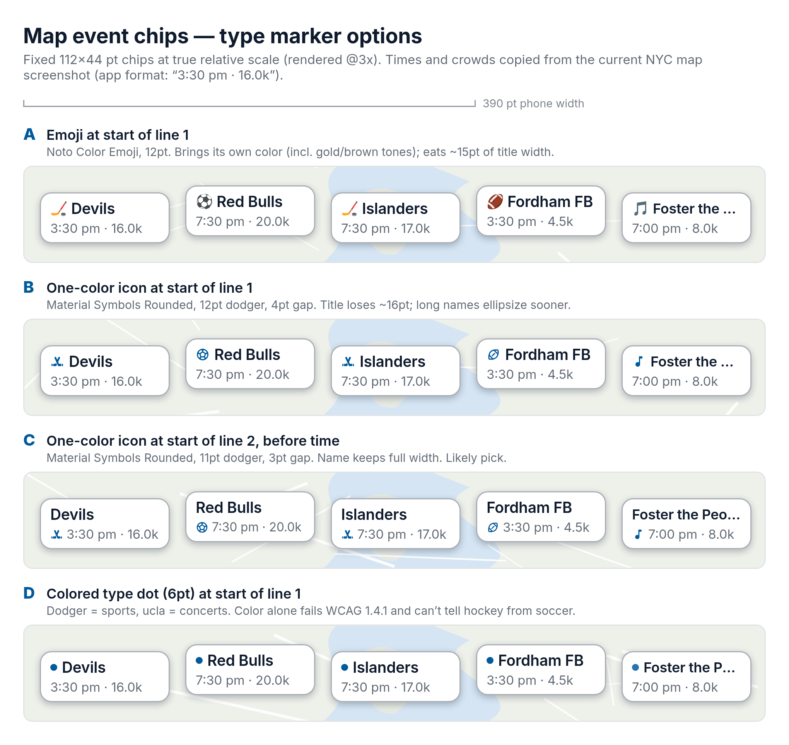
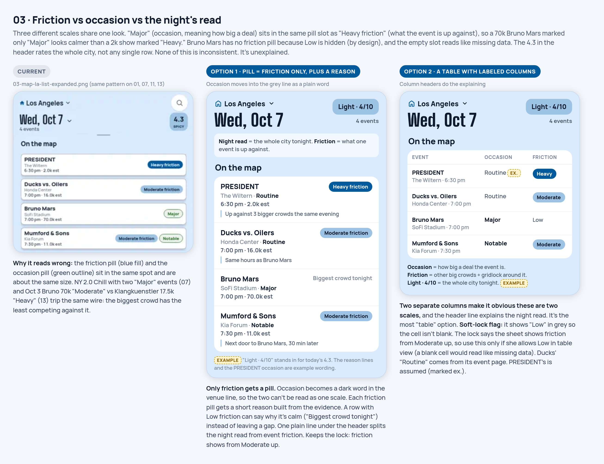
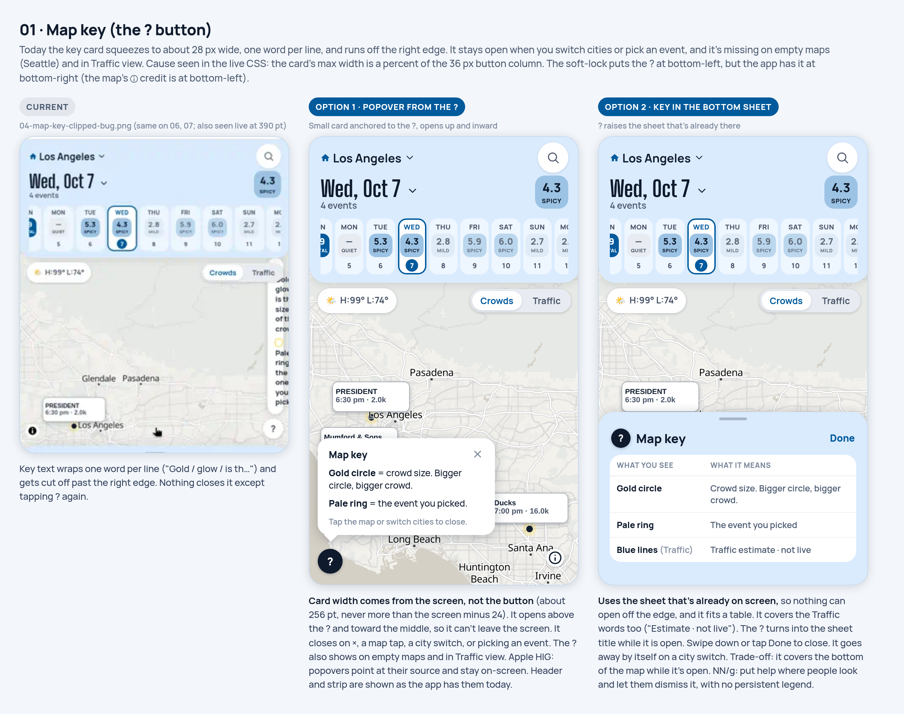
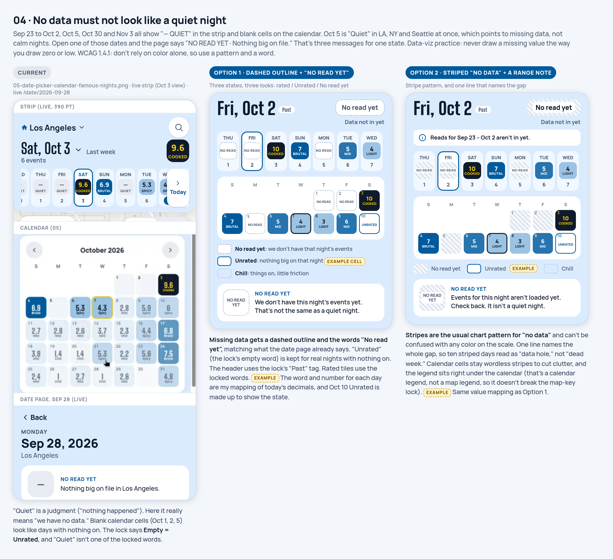
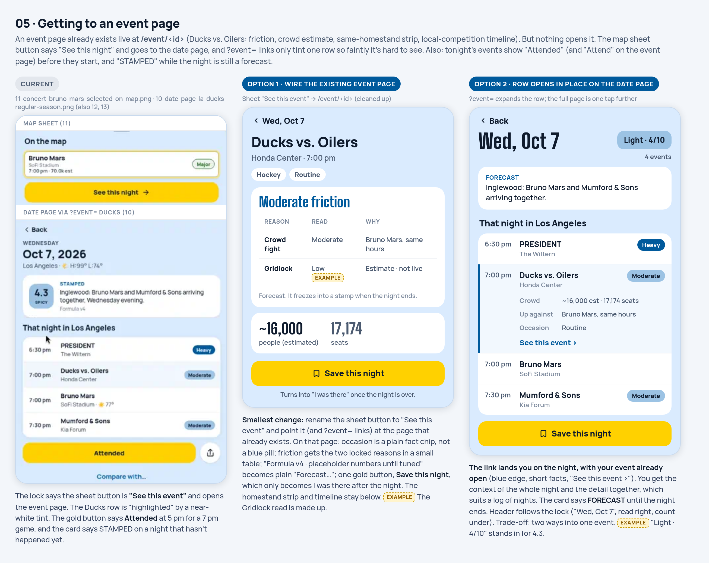
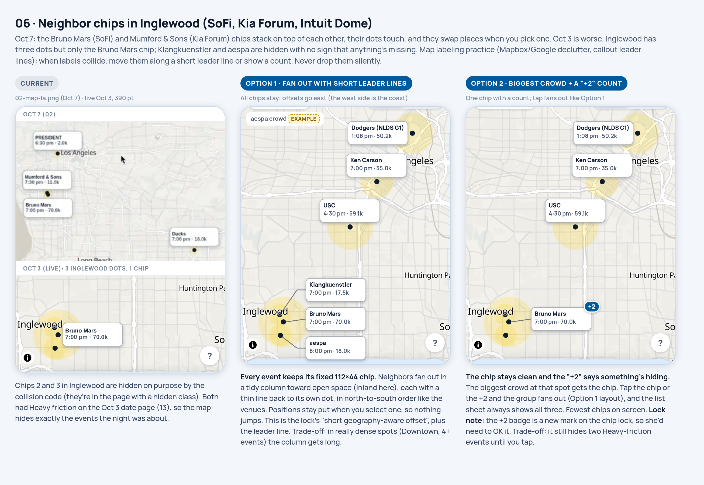
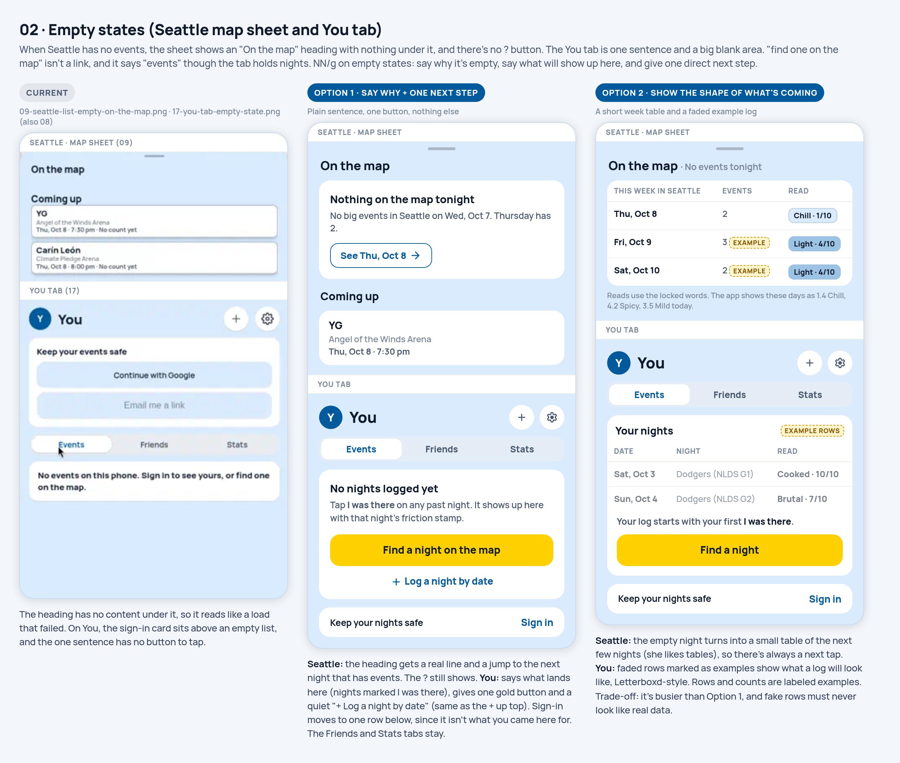

# Fan/Friction gap review by GrokBot/Cursor: October 7, 2026

**Author:** GrokBot/Cursor (as Kylie identified it when she pasted it into Claude Code). The text itself credits a data and code audit at commit `77efafa`, a design review labelled "Mock Mosaic," and Kylie's own Oct 7 notes.
**Review produced:** October 7, 2026, around 5 PM PT (per the text below).
**Saved to the repo:** October 7, 2026 at 8:13 PM PDT (UTC−07:00), by Claude Code (Sonnet 5.5), from the text and 24 images Kylie pasted into the session.
**Status:** Open. Nothing here is decided or approved for building.
**What was changed on saving:** nothing in the text below the line. Image links now point into `assets/grokbot-cursor-2026-10-07-2013-pt/`. The mockups' HTML/CSS sources were not in the first paste. Kylie sent them at 8:20 PM PDT the same evening, and they are saved in `mockups/src/` (six pages, `base.css`, `build.py`, `render.js`, 14 icons, and the images the pages use). The six `.built.html` files there were regenerated by running the included `build.py`, not copied from the paste; the 14 `.png` and 6 `.html` sources were saved as sent. `render.js` still points at the original author's machine paths, so it will not run as is. Its issue IDs (A1, B2, …) are its own; the Codex review's IDs (D01, …) are separate. See [the index](README.md).

---

# Fan/Friction gap review: Oct 7, 2026

**What this is.** A list of issues found in Fan/Friction on Oct 7, 2026, each with one or two *possible* fixes. **Nothing here is decided.** There are no picks and no build order. Every fix is written as an option. Kylie and Claude decide together later.

**How to use this with Claude.**
1. Read the whole document, including the screenshots and mockups it links to.
2. For any issue Kylie points to, propose an approach: which option (or a different one), what files it touches, and what the trade-offs are.
3. **Wait for Kylie's OK before building anything.** Don't treat the order of this list, or any option, as approval.

**Sources.**
- **Live app**: https://fan-friction.vercel.app, viewed at phone width with home set to Los Angeles, on Oct 7, 2026 (PT). The screenshots are in `screenshots/`.
- **Repo**: `kylieau/fan-friction` at commit `77efafa`. This was a read-only data and code audit run around 5 PM PT on Oct 7. Saved schedules were re-run through the current estimate code for Oct 7–21.
- **Design review**: Mock Mosaic (design review) went through the live app and produced a 32-row UX table, a list of places where the app differs from Kylie's earlier direction, and six mockups. The mockups are in `mockups/`, with their HTML/CSS sources in `mockups/src/`. Each mockup shows the current screen next to Option 1 and Option 2.
- **Kylie's own notes** from Oct 7 (next section).

**Reading the priorities.** P1 means misleading or broken: wrong meaning, off-screen, a dead end, or wrong data. P2 means confusing copy, an inconsistency, or a data gap that weakens results. P3 means polish or a lower-impact gap. Issue IDs (A1, B2, …) are only for reference. They don't set an order of work.

**Words used here.**
- **Night read**: the city-wide rating for a date, like "4.3 Spicy".
- **Friction**: for a single event, how much of its crowd is pulled away or competed for by other events (the "crowd fight") plus traffic ("gridlock").
- **Occasion**: how big a deal an event is (Routine / Notable / Major).
- **Chip**: the small label on the map next to an event's dot.
- **Sheet**: the panel that slides up from the bottom of the map.
- **Earlier direction**: decisions Kylie made in earlier design rounds. They're treated here as a reference point, not a rule.

---

## 1. Kylie's notes (Oct 7, 2026)

> These are Kylie's own notes, included in full. She wrote them as "issues + possible fixes," not decisions. Each one also appears in the unified list below, where the note is linked rather than repeated.

### K1. Ticketmaster add-ons show as separate events
**Kylie's note:** Ticketmaster add-on listings tied to a main event should not show up as separate events. Her example is "2026 New York Liberty Benchwarmers Pre-Game Pass (Watch Warm-Ups)" listed next to Liberty vs. Dream at Barclays. **Possible fix:** hide add-ons (pre-game passes, parking, VIP/premium/club/experience, "Not an Event Ticket") from display, ideally by filtering them rather than deleting them from the data.
**Status:** Open. The audit found the same thing and adds that most of these add-ons also inflate friction. See **[A1](#a1-p1-add-on-listings-show-as-events-and-count-as-phantom-crowds)**.

### K2. Playoff games had no expected crowd
**Kylie's note:** Playoff games showed "No count yet" (for example, Liberty vs. Dream Semifinals G3).
**Status: partly done today.** Claude added playoff estimates on Oct 7:
- MLB, NBA, NHL and MLS estimates are based on past playoff crowds.
- WNBA, NFL and NWSL fall back to the building's capacity.

**Remaining:** college postseason games still have no estimate. WNBA, NFL and NWSL use the full building, which could be refined with research.

A research prompt (written for a Claude chat) asks for:
- per-league sellout rates by round
- whether the game number in a series matters
- sources
- when a team's own history should override a league-wide rule
- a simple rule with a range
- edge cases: neutral sites, curtained upper decks, WNBA teams playing in NBA arenas, short-notice games
- a self-audit

See **[A6](#a6-p2-playoff-estimates-whats-still-missing)**. This note is also related to **[B3](#b3-p1-if-necessary-playoff-games-shown-as-definite)** (playoff games that may not happen).

### K3. City switcher repeats "Set as home" on every row
**Kylie's note:** The city switcher repeats "Set as home" on every row. The design review suggested:
- Remove it from the rows.
- Add one "Change home…" item at the bottom, under a divider. It reopens the first-run "Where's home?" picker, with the helper text "Your map opens here. Change it anytime."
- Keep the house icon on the home city.
- Hide cities that have no events.

**Kylie's reaction:** she liked it.
**Status:** Open. See **[C10](#c10-p2-city-switcher-repeats-set-as-home-on-every-row)**.

### K4. Hard to tell event type on map chips (concert vs. sport)
**Kylie's note:** It's hard to tell what kind of event a map chip is (concert or sport). The design review's option C, which Kylie OK'd:
- A one-color Material Symbols Rounded icon in dodger blue #005A9C at the start of chip line 2, before the time (sports_hockey, sports_soccer, sports_football, music_note, …), with a 3 pt gap.
- Crop the SVG padding so the glyph reads at about 11 pt.
- Show the crowd rounded ("20k", not "20.0k") so line 2 still fits.
- The name line keeps its full width.

Other options that were mocked: an emoji on line 1, an icon on line 1, and a colored dot.

**Status:** Open. See **[C9](#c9-p2-event-type-is-hard-to-tell-on-map-chips)**.

---

## 2. Issues and possible fixes

Group summary:

| Group | Issues | P1 | P2 | P3 |
|---|---|---|---|---|
| A. Data accuracy and coverage | 16 | 4 | 7 | 5 |
| B. Formula and labels | 7 | 4 | 3 | 0 |
| C. UX/UI presentation | 26 | 7 | 12 | 7 |
| D. Differs from earlier direction | 5 | 0 | 5 | 0 |
| E. Docs out of date | 4 | 0 | 2 | 2 |
| **Total** | **58** | **15** | **29** | **14** |

---

### A. Data accuracy and coverage

#### A1 (P1). Add-on listings show as events and count as phantom crowds
*Also in: Kylie's note [K1](#k1-ticketmaster-add-ons-show-as-separate-events), audit code gap 3 and the no-estimate table.*
- **What's wrong:** Ticketmaster sells extras (pre-game passes, "Premium" packages, club access) as their own listings, and the app shows them as separate events. The audit found 5 add-ons or not-a-ticket listings in the Oct 7–21 window:
  - "Premium: AIR SUPPLY" in LA
  - 2 WAMU "Amplified Access (Not an Event Ticket)" in Seattle
  - the Liberty Pre-Game Pass in NY
  - "Delta Sky360 Club Experience" in Atlanta

  The bigger problem: 4 of the 5 are in rooms of 6,000+ seats. Those 4 are fed into friction as if they were real crowds, so they make other events look more contested than they are.
- **Where in code:** `isAddOn()` doesn't catch the words "Pass", "Experience", "Premium", "Club" or "Not an Event Ticket".
- **Possible fixes (options):**
  - **Option 1:** Widen the add-on filter to cover those terms, and apply it to both display and friction while keeping the raw listings in the data (Kylie's "filter, don't delete").
  - **Option 2:** Keep add-ons in the data with an "add-on" flag pointing to their main event. Hide them from lists, the map and friction, but keep them available for audits, or as a small note on the main event if that's ever useful.
- **Visuals:** No screenshot captured.
- Duplicate listings are a related import issue. See [A11](#a11-p2-duplicate-listings).

#### A2 (P1). Ticketmaster may be cutting off concerts late in each 30-day window
- **What's wrong:** This is inferred, not proven. Concerts more than about two weeks out look thin:

  | Metro | Concerts over 120 days | In the first 14 days |
  |---|---|---|
  | New York | 44 | 15 |
  | Chicago | 41 | 13 |
  | LA | 192 | 50 |

  Each pull is capped at 1,000 results per 30-day window, sorted by date. Junk listings eat that budget: Balloon Museum 810, Selfie Paradise Museum 1,831, The Fields Studios 1,810. The blank Oct 30 is probably this cutoff (see [Not verified](#3-not-verified)).
- **Where in code:** `ticketmasterSource.ts`.
- **Possible fixes (options):**
  - **Option 1:** Pull in 7-day windows instead of 30-day windows so each window stays under the cap.
  - **Option 2:** Filter out junk segments and venues (museums, "experience" spaces) before they use up the budget, and log a warning whenever a window hits the cap. This can be combined with Option 1.
- **Visuals:** [05 calendar](assets/grokbot-cursor-2026-10-07-2013-pt/screenshots/05-date-picker-calendar-famous-nights.png) (the Oct 30 blank).

#### A3 (P1). Past dates are missing from the data
*Also in: design review #2. How the gaps look on screen is covered in [C2](#c2-p1-missing-data-looks-like-a-quiet-night).*
- **What's wrong:** Sep 23–Oct 2 show "Quiet", and Oct 1 and Oct 2 are blank, because the past data simply isn't there:
  - The feeds only serve today onward.
  - The shared catalog started Oct 6.
  - Saved schedules start Oct 4 (LA), Oct 6 (NY, San Diego, Seattle) and Oct 7 (all other metros).
  - The only hand-entered past nights are LA Oct 3–4 and a tester's Sep 20, Oct 1 and Oct 3.
- **Where in code / data:** feed sources and the schedule archive (`data/schedule-archive/`).
- **Possible fixes (options):**
  - **Option 1:** Rebuild past home games from the attendance files. They hold real counts (for example, Dodgers through Oct 4).
  - **Option 2:** Leave the past un-backfilled but mark those dates clearly as "no data" (see [C2](#c2-p1-missing-data-looks-like-a-quiet-night)). This can be combined with Option 1 for dates that can't be rebuilt.
- **Visuals:** [05 calendar](assets/grokbot-cursor-2026-10-07-2013-pt/screenshots/05-date-picker-calendar-famous-nights.png), [02 map LA strip](assets/grokbot-cursor-2026-10-07-2013-pt/screenshots/02-map-la.png), mockup [04 no data vs quiet](assets/grokbot-cursor-2026-10-07-2013-pt/mockups/04-no-data-vs-quiet.png).

#### A4 (P1). Neutral-site games land in the wrong city or get sized at full building
- **What's wrong:** Some college games are played at neutral sites:
  - UCLA women's basketball vs. Oklahoma at Prudential Center (New Jersey) shows up in **LA**.
  - USC women's basketball vs. Baylor at Intuit Dome and UCLA vs. Gonzaga at Honda Center are sized as if they fill the whole building.
- **Where in code:** `espnSource.ts` ignores the feed's neutral-site flag and doesn't check that the venue is in the metro.
- **Possible fixes (options):**
  - **Option 1:** Require the venue's metro to match before placing a game in a city.
  - **Option 2:** Treat neutral-site games as their own case: place them by venue and use a separate (smaller) size rule.
- **Visuals:** No screenshot.

#### A5 (P2). 21 of 241 events have no crowd estimate, and some still count as a full building
- **What's wrong:** Across all seven metros for Oct 7–21, 21 of 241 events have no estimate:

  | Metro | Events | No estimate | Examples |
  |---|---|---|---|
  | LA | 69 | 4 | Air Supply "Premium" add-on, Ilana Glazer comedy, two theatre nights at Hollywood Bowl |
  | San Diego | 18 | 2 | USD women's volleyball ×2 (Ticketmaster sport) |
  | Seattle | 21 | 3 | 2 WAMU "Amplified Access" add-ons, Tacoma Holiday Festival |
  | New York | 48 | 3 | Liberty Pre-Game Pass, Pacha 21+ night, 30 Rock anniversary at Radio City |
  | Bay Area | 27 | 4 | Disney On Ice ×4 at Oakland Arena |
  | Atlanta | 32 | 2 | Atlanta Symphony at Ameris, "Delta Sky360 Club Experience" add-on |
  | Chicago | 26 | 3 | Northwestern at new Ryan Field, Chicago Stars at Martin Stadium, comedy at Wintrust |

  By reason:
  - 5 add-ons (see [A1](#a1-p1-add-on-listings-show-as-events-and-count-as-phantom-crowds))
  - 2 college sports listed through Ticketmaster
  - 12 theatre, comedy, classical, ice show, expo or club nights
  - 2 games in a building the team has no history in

  None of the gaps came from missing venue capacity or coordinates, unknown venue IDs, feed teams with no attendance rows, or blank playoff games.

  There's also an inconsistency. Theatre, comedy and ice shows in big rooms show no estimate on screen, but friction counts them as a **full building** (Disney On Ice ×4, Hollywood Bowl theatre, Tacoma Holiday Festival).
- **Where in code:** `knownSize()` in `read.ts`.
- **Possible fixes (options):**
  - **Option 1:** Give these event types an estimate, for example a per-type share of the room, so what's shown and what's counted match.
  - **Option 2:** Treat unsized events the same way everywhere: leave them out of friction until there's an estimate, and show a clear "size TBA" label (see [B7](#b7-p2-no-count-yet-and-no-read-yet-sound-like-the-same-thing)).
- **Visuals:** No specific screenshot.

#### A6 (P2). Playoff estimates: what's still missing
*Also in: Kylie's note [K2](#k2-playoff-games-had-no-expected-crowd) (partly done today).*
- **What's wrong:**
  - College postseason games are never sized.
  - WNBA, NFL and NWSL playoff games use full building capacity.
  - There's no playoff history at all for NWSL, NFL, WNBA or college.
  - The saved schedules were captured before today's playoff changes, so saved WNBA playoff games had no estimate. They now get building capacity: 17,732 / 17,600 / 18,064.
- **Where in code:** `roundBand()` in `expectedDrawBuild.ts` returns nothing for college.
- **Possible fixes (options):**
  - **Option 1:** Use the results of Kylie's research prompt to set a per-league rule (sellout rate by round, with a range) for WNBA, NFL, NWSL and college, and keep team history as an override where it exists.
  - **Option 2:** Keep building capacity as the fallback, but label it on screen as an upper bound (for example "up to 18,064") until better data exists.
- **Visuals:** [12 Yankees ALDS G3](assets/grokbot-cursor-2026-10-07-2013-pt/screenshots/12-playoff-yankees-alds-g3-date-page-ny.png), [13 NLDS G1 night](assets/grokbot-cursor-2026-10-07-2013-pt/screenshots/13-playoff-nlds-g1-night-la-oct3.png).

#### A7 (P2). This season's results are mostly missing, and 2026 attendance isn't collected for four leagues
- **What's wrong:**
  - `SEASON_LEVELS` is empty for every team (this season's results only exist from Oct 3).
  - The attendance collector stops at 2025 for MLS, NWSL, NFL and college football, so MLS and NWSL skip almost all of 2026. San Diego FC's estimates rest on 2025 alone.
- **Where in code:** `attendance-collect.mjs`.
- **Possible fixes (options):**
  - **Option 1:** Add 2026 for those leagues in `attendance-collect.mjs` and re-run it.
  - **Option 2:** Fill `SEASON_LEVELS` from the refreshed 2026 attendance so current-season form counts.
- **Visuals:** None.

#### A8 (P2). 234 home games have no start time
- **What's wrong:** 234 of 917 ESPN home games in the next 120 days have no start time:

  | Metro | Games without a start time |
  |---|---|
  | Atlanta | 77 |
  | Bay Area | 61 |
  | Chicago | 44 |
  | LA | 23 |
  | San Diego | 15 |
  | Seattle | 13 |
  | NY | 1 |

  These games get a default start time, which makes the overlap math with other events weaker.
- **Where in code:** ESPN source (`espnSource.ts`).
- **Possible fixes (options):**
  - **Option 1:** Re-pull start times as the feed fills them in, and show "time TBA" until then.
  - **Option 2:** Treat a missing start time as uncertain overlap (for example, a lower overlap weight) instead of a confident default time.
- **Visuals:** None.

#### A9 (P2). Opponent adjustment misses some visiting teams
- **What's wrong:** Upcoming games use keys like "sacramento-kings", "winnipeg-jets" and "dallas-stars", but past data uses "Kings", "Jets" and "Stars". Adding the Chicago Stars also created a name clash. As a result, the "who's visiting" boost or discount doesn't apply for those opponents.
- **Where in code:** the opponent adjustment in the estimate build (exact file not named in the audit).
- **Possible fixes (options):**
  - **Option 1:** Key opponents by team ID in both past and upcoming data.
  - **Option 2:** Add an alias table that maps both forms to one ID. This is lighter, but has to be maintained.
- **Visuals:** None.

#### A10 (P2). Team badges and names are inconsistent
*Also in: design review #22 and #30. How this looks on screen is in [C15](#c15-p2-favorites-list-is-hard-to-scan) and [C24](#c24-p3-vs-and-vs-both-used).*
- **What's wrong:**
  - The Clippers and Chargers both use the badge "LAC". Badges are also shared in San Diego, Seattle, Atlanta, the Bay Area (SF) and Chicago.
  - Names are mixed: "Washington Huskies vs. Iowa", "San Diego St", "Dallas Stars".
  - One name has a trailing space: "Roots vs. San Antonio ".
  - Ticketmaster names come through raw: "Premium: AIR SUPPLY".
- **Where in code:** `teams.ts` (badges); `nameOf()` in `espnSource.ts` (names).
- **Possible fixes (options):**
  - **Option 1:** Give every team a unique badge and apply one naming rule (with trimming) in a single place.
  - **Option 2:** Store a short display name per team in `teams.ts` and use it everywhere instead of building names from the feed.
- **Visuals:** [16 favorites](assets/grokbot-cursor-2026-10-07-2013-pt/screenshots/16-favorites-teams-venues.png).

#### A11 (P2). Duplicate listings
- **What's wrong:** Billy Strings is listed twice. The duplicate check includes the start time, and one copy has no start time.
- **Where in code:** the dedupe step (exact file not named in the audit).
- **Possible fixes (options):**
  - **Option 1:** Dedupe on date + venue + performer, ignoring the time.
  - **Option 2:** Same as Option 1, but prefer the copy that has a start time when merging.
- **Visuals:** None.

#### A12 (P3). All-day events barely register
- **What's wrong:** Comic Con is modeled as 2.5–3 hours starting at 10:00, so its share of any crowd fight comes out as 0.
- **Possible fixes (options):**
  - **Option 1:** Use real durations for multi-hour and all-day events.
  - **Option 2:** Add a per-event-type default duration (festival, convention, fair).
- **Visuals:** [07 New York](assets/grokbot-cursor-2026-10-07-2013-pt/screenshots/07-map-new-york.png) (New York Comic Con in "Coming up").

#### A13 (P3). Venue data gaps
- **What's wrong:**
  - Some venues have no concert setup recorded: LA 6, San Diego 5, Seattle 5, NY 11, Atlanta 9, Bay Area 9, Chicago 9. Several big stadiums are also untagged (see [B5](#b5-p2-some-stadium-concerts-read-100-full-instead-of-57)).
  - None of the 147 venues has a Ticketmaster venue ID, so venues are matched by name only.
  - In Chicago, 22 of 23 venues lack a hard-access measurement (see [E4](#e4-p3-chicago-checklist-says-hard-access-is-done)).
- **Possible fixes (options):**
  - **Option 1:** Add Ticketmaster venue IDs so matching doesn't depend on names.
  - **Option 2:** Fill in concert setups and Chicago hard-access data metro by metro.
- **Visuals:** None.

#### A14 (P3). Team coverage gaps
- **What's wrong:**
  - The Sparks have no feed or attendance data (this starts to matter in May 2027).
  - The Seattle Storm are missing from the teams list.
  - UCLA and USC baseball and volleyball have no feed.
  - There's no opponent data for ucla-football, san-diego-fc, ksu-football or northwestern-football.
- **Possible fixes (options):**
  - **Option 1:** Add the missing teams and feeds before their seasons start.
  - **Option 2:** List known coverage gaps in one doc so they're tracked (see [E](#e-docs-out-of-date)).
- **Visuals:** [16 favorites](assets/grokbot-cursor-2026-10-07-2013-pt/screenshots/16-favorites-teams-venues.png).

#### A15 (P3). Saved schedules are fresh but shallow
- **What's wrong:** All saved schedules were captured on Oct 7 at 4:39 PM PT. They only go back 4 days in LA, 2 days in NY, San Diego and Seattle, and 1 day everywhere else. They were saved before today's playoff changes (see [A6](#a6-p2-playoff-estimates-whats-still-missing)).
- **Possible fixes (options):**
  - **Option 1:** Keep saving daily so depth builds up, and re-save after estimate-code changes.
  - **Option 2:** Backfill the archive from attendance files (see [A3](#a3-p1-past-dates-are-missing-from-the-data)).
- **Visuals:** None.

#### A16 (P3). Concerts disappear if the database is down
- **What's wrong:** If Supabase is unreachable, the fallback only loads MLB and ESPN games, so every concert vanishes.
- **Where in code:** `catalogSource.ts`.
- **Possible fixes (options):**
  - **Option 1:** Fall back to the latest saved schedule, which includes concerts.
  - **Option 2:** Show a "concerts unavailable right now" note so the map isn't silently missing them.
- **Visuals:** None.

---

### B. Formula and labels

#### B1 (P1). Per-event friction looks backwards next to crowd size and occasion
*Also in: audit observation 1, design review #3. Related: [C13](#c13-p2-occasion-is-styled-differently-on-each-screen).*
- **What's wrong:** The formula works as designed. The problem is that nothing explains what it means.
  - **The biggest crowd tends to show the lowest friction.** An event's friction is the share of *its own* crowd that other events are competing for. So:
    - PRESIDENT at the Wiltern (2k) is 49%, which shows as "Heavy friction".
    - Bruno Mars at SoFi (70k) is 3%, which counts as "Low". Low is hidden by design, so his row shows only the occasion pill, "Major".
    - On Oct 3: Bruno Mars is Moderate (15%) while Klangkuenstler is Heavy (38%).
  - **Occasion looks like a friction level.** "Major" (occasion) sits in the same pill slot as "Heavy friction". It's easy to read the two as one scale and decide the app contradicts itself. The empty slot for Low reads like missing data.
  - **The header number isn't about any one row.** The 4.3 rates the whole city, not a single event.
  - **NY on Oct 7 is a 2.0 day despite two "Major" events.** The baseball game and the concert barely overlap (overlap 0.15), so only 3,259 seats are "in a fight". Gridlock is 1.0 because one full building in its area is treated as normal.
- **Where in code:** `eventCrowdFight` in `formula/crowdFight.ts`; `showFriction` (hides Low); `formula/gridlock.ts`.
- **Possible fixes (options):**
  - **Option 1 (labels and presentation):** Only friction gets a pill (Moderate and up), with a short reason line under it ("Up against 3 bigger crowds the same evening"). Occasion becomes a plain word in the venue line. Add one line under the header: "Night read = the whole city tonight. Friction = what one event is up against." Possible wording: "up against". **Mockup 03, Option 1.**

    A variant is a table with labeled columns (Event / Occasion / Friction) and a short key. *This variant differs from earlier direction:* it shows "Low" in grey so no cell is blank, while the earlier direction showed friction only from Moderate up. **Mockup 03, Option 2.**
  - **Option 2 (new measure):** Add a separate "strains the area" signal based on the event's own size and location, so a 70k show can read as a big load on the area even when little is competing with it.
- **Visuals:** [01 home](assets/grokbot-cursor-2026-10-07-2013-pt/screenshots/01-home-la.png), [03 list expanded](assets/grokbot-cursor-2026-10-07-2013-pt/screenshots/03-map-la-list-expanded.png), [07 New York](assets/grokbot-cursor-2026-10-07-2013-pt/screenshots/07-map-new-york.png), [11 Bruno Mars selected](assets/grokbot-cursor-2026-10-07-2013-pt/screenshots/11-concert-bruno-mars-selected-on-map.png), [13 Oct 3](assets/grokbot-cursor-2026-10-07-2013-pt/screenshots/13-playoff-nlds-g1-night-la-oct3.png).

#### B2 (P1). Events under 5,000 still appear on the map and still get friction labels
*Also in: audit observation 6, design review (added).*
- **What's wrong:** There are 19 events under 5k in the window:
  - 13 in LA, mostly at the Wiltern (1,850) and the Belasco (1,500)
  - 2 in San Diego
  - 3 in NY
  - 1 in the Bay Area

  These events don't feed friction, but they still show on the map and still get friction labels. That's how a 2k show like PRESIDENT ends up marked "Heavy".
- **Where in code:** `showsOnMap()` in `map/crowdPoints.ts` only checks a hand-set `belowFloor` flag, and that flag is never set on Ticketmaster listings.
- **Possible fixes (options):**
  - **Option 1:** Only put events on the map if their size tier feeds friction.
  - **Option 2:** Keep small events visible but clearly secondary (for example, list-only or a muted dot) and never give them a friction label.
- **Visuals:** [01 home](assets/grokbot-cursor-2026-10-07-2013-pt/screenshots/01-home-la.png), [02 map LA](assets/grokbot-cursor-2026-10-07-2013-pt/screenshots/02-map-la.png), [03 list expanded](assets/grokbot-cursor-2026-10-07-2013-pt/screenshots/03-map-la-list-expanded.png) (PRESIDENT, 2.0k, "Heavy friction").

#### B3 (P1). "If necessary" playoff games shown as definite
*Also in: audit code gap 2, design review (added). Related: [K2](#k2-playoff-games-had-no-expected-crowd).*
- **What's wrong:** 5 games in the window only happen if a series goes long:
  - Yankees ALDS G4 (Oct 8)
  - Dodgers NLDS G5 (Oct 9)
  - Liberty G4 (Oct 11)
  - Dream G5 and Valkyries G5 (Oct 14)

  The app shows them as scheduled and counts them. NY's Oct 8 rates 7.3, led by the possible Yankees G4.
- **Where in code:** `mlbSource.ts` ignores MLB's if-necessary flag; `roundLabel.ts` strips WNBA's "If Necessary".
- **Possible fixes (options):**
  - **Option 1:** Carry an if-necessary flag through the data and show it: an "If needed" tag plus a faded chip.
  - **Option 2:** Keep these games out of friction and the night read until they're confirmed. This can be combined with Option 1.
- **Visuals:** [07 New York strip](assets/grokbot-cursor-2026-10-07-2013-pt/screenshots/07-map-new-york.png) (Thu Oct 8 7.3).

#### B4 (P1). Compare shows a total higher than every one of its parts
*Also in: design review #9. The third reason ("Conditions") is in [D4](#d4-p2-weather-conditions-shown-as-a-third-friction-reason).*
- **What's wrong:** On Compare, the night read is 9.6, but every part is lower: Crowd fight 8.3, Conditions 6.7, Gridlock 4.5. A total above all its parts looks like a bug.
- **Possible fixes (options):**
  - **Option 1:** Show the parts as words (Crowd fight: Brutal, Gridlock: Light) instead of decimals, with a footnote: "The read isn't an average of these."
  - **Option 2:** Show only the reasons that make up friction, and show how they combine (or say plainly that they don't simply add up).
- **Visuals:** [15 compare side by side](assets/grokbot-cursor-2026-10-07-2013-pt/screenshots/15-compare-side-by-side.png).

#### B5 (P2). Some stadium concerts read 100% full instead of 57%
*Related: [E2](#e2-p2-backlog-57-ballpark-note-doesnt-match-the-code).*
- **What's wrong:** Concerts in sports stadiums are meant to come out around 57% of the building (the ballpark figure noted in BACKLOG). Some read 100% instead: Bruno Mars is at 70,240. This happens because venues with no setup-tagged capacity are treated as "built for shows". The untagged venues are SoFi, Dodger Stadium, the Coliseum, Angel Stadium, Nassau Coliseum and Arthur Ashe.
- **Where in code:** `showDraw()`.
- **Possible fixes (options):**
  - **Option 1:** Tag the sports setups for those stadiums.
  - **Option 2:** Add a venue-type field (stadium / arena / theatre) and base the default on it.
- **Visuals:** [11 Bruno Mars selected](assets/grokbot-cursor-2026-10-07-2013-pt/screenshots/11-concert-bruno-mars-selected-on-map.png).

#### B6 (P2). The friction reason line reads as unrelated
*Also in: design review #17.*
- **What's wrong:** The Ducks event page says "Bruno Mars 28 mi away, same hours." Twenty-eight miles sounds like no competition at all, so it reads like a bug. The share card also has a double period.
- **Possible fixes (options):**
  - **Option 1:** When gridlock is the reason, name the actual link ("Same hours as Bruno Mars, shares the 405 home").
  - **Option 2:** Drop the distance: "Same hours as Bruno Mars (70k)".
- **Visuals:** [10 Ducks date page](assets/grokbot-cursor-2026-10-07-2013-pt/screenshots/10-date-page-la-ducks-regular-season.png), mockup [05 event page](assets/grokbot-cursor-2026-10-07-2013-pt/mockups/05-event-page.png).

#### B7 (P2). "No count yet" and "No read yet" sound like the same thing
*Also in: design review #15.*
- **What's wrong:** These are two different facts. "No count yet" is about the crowd size; "No read yet" is about the night's friction read. The wording is almost identical, so people will think it's the same missing thing.
- **Possible fixes (options):**
  - **Option 1:** Use "Crowd size TBA" for counts, and keep "No read yet" for the read.
  - **Option 2:** Drop the count placeholder entirely and show just the time until a count exists.
- **Visuals:** [03 list expanded](assets/grokbot-cursor-2026-10-07-2013-pt/screenshots/03-map-la-list-expanded.png), [07 New York](assets/grokbot-cursor-2026-10-07-2013-pt/screenshots/07-map-new-york.png), [09 Seattle list](assets/grokbot-cursor-2026-10-07-2013-pt/screenshots/09-seattle-list-empty-on-the-map.png).

---

### C. UX/UI presentation

#### C1 (P1). The map key breaks
*Also in: design review #1. The button's position is in the [D table](#also-differs-from-earlier-direction-covered-elsewhere).*
- **What's wrong:**
  - The key card squeezes to about 28 px wide (one word per line) and runs off the right edge.
  - It stays open after a city switch or an event pick, covering chips.
  - There's no ? button on the empty Seattle map or in Traffic view.
- **Where in code:** the card's max width is set as a percent of the 36 px button column (live CSS).
- **Possible fixes (options):**
  - **Option 1:** A popover anchored to the ? that opens up and inward, with its width based on the screen (about 256 pt, never more than the screen minus 24). It closes on ×, a map tap, a city switch or an event pick, and the ? is always present. **Mockup 01, Option 1.**
  - **Option 2:** The ? raises the existing bottom sheet as a "Map key" table (What you see / What it means), including "Blue lines = traffic estimate · not live". Swipe down or tap Done to close. **Mockup 01, Option 2.**
- **Visuals:** [04 map key clipped](assets/grokbot-cursor-2026-10-07-2013-pt/screenshots/04-map-key-clipped-bug.png), [06](assets/grokbot-cursor-2026-10-07-2013-pt/screenshots/06-city-switcher.png), [07](assets/grokbot-cursor-2026-10-07-2013-pt/screenshots/07-map-new-york.png), [08 Seattle](assets/grokbot-cursor-2026-10-07-2013-pt/screenshots/08-map-seattle-no-events.png), [09](assets/grokbot-cursor-2026-10-07-2013-pt/screenshots/09-seattle-list-empty-on-the-map.png).

#### C2 (P1). Missing data looks like a quiet night
*Also in: design review #2. Data cause: [A3](#a3-p1-past-dates-are-missing-from-the-data). The word "Quiet" is also in the [D table](#also-differs-from-earlier-direction-covered-elsewhere).*
- **What's wrong:**
  - Sep 23–Oct 2, Oct 5, Oct 30 and Nov 3 show "— QUIET" in the date strip and blank cells on the calendar.
  - Oct 5 is "Quiet" in LA, NY and Seattle at the same time.
  - Opening a missing date shows "NO READ YET · Nothing big on file."

  That's three messages for one state. For a log of your nights, calling a data gap "Quiet" states something false.
- **Possible fixes (options):**
  - **Option 1:** Three states with three looks:
    - rated (word + number)
    - **Unrated** for real nights with nothing on
    - **No read yet** (dashed outline) for missing data

    Use the same words in the header, strip, calendar and date page. **Mockup 04, Option 1.**
  - **Option 2:** A striped "no data" pattern plus one line naming the gap ("Reads for Sep 23 – Oct 2 aren't in yet"), with a legend under the calendar. **Mockup 04, Option 2.**
- **Visuals:** [05 calendar](assets/grokbot-cursor-2026-10-07-2013-pt/screenshots/05-date-picker-calendar-famous-nights.png), strips in [02](assets/grokbot-cursor-2026-10-07-2013-pt/screenshots/02-map-la.png), [03](assets/grokbot-cursor-2026-10-07-2013-pt/screenshots/03-map-la-list-expanded.png), [07](assets/grokbot-cursor-2026-10-07-2013-pt/screenshots/07-map-new-york.png), [08](assets/grokbot-cursor-2026-10-07-2013-pt/screenshots/08-map-seattle-no-events.png).

#### C3 (P1). "Attended" shows on tonight's events before they start
*Also in: audit observation 4, design review #4. The button wording is also in the [D table](#also-differs-from-earlier-direction-covered-elsewhere).*
- **What's wrong:** The screens were taken around 5 PM PT for 6:30–8 PM events, and the date page already says "Attended". The event page says "Attend". This claims you went to something that hasn't happened yet, and it writes to the You tab.
- **Where in code:** `DateScreen.tsx:95` uses `date > today`, while `EventScreen.tsx:109` uses `date >= today`.
- **Possible fixes (options):**
  - **Option 1:** Compare against the event's start time (or the existing 24-hour cutoff) in both screens. Pair this with time-based labels: upcoming = "Save this night", after the night ends = "I was there", after logging = a quiet "You were there." **Mockup 05.**
  - **Option 2:** Same labels, but switch to "I was there" at the event's **start** time rather than its end, so people can log from the stands. Start vs. end is an open question for Kylie.
- **Visuals:** [10 Ducks date page](assets/grokbot-cursor-2026-10-07-2013-pt/screenshots/10-date-page-la-ducks-regular-season.png), [12 Yankees](assets/grokbot-cursor-2026-10-07-2013-pt/screenshots/12-playoff-yankees-alds-g3-date-page-ny.png), [13 Oct 3](assets/grokbot-cursor-2026-10-07-2013-pt/screenshots/13-playoff-nlds-g1-night-la-oct3.png).

#### C4 (P1). "STAMPED" on a night that hasn't happened yet
*Also in: design review #5. Also in the [D table](#also-differs-from-earlier-direction-covered-elsewhere).*
- **What's wrong:** Tonight's card says "STAMPED" plus "Formula v4". A stamp reads as final, but tonight is still a forecast and can change.
- **Possible fixes (options):**
  - **Option 1:** Label it "Forecast" until the night ends, then "Stamped · Wed, Oct 7". **Mockup 05, Option 2.**
  - **Option 2:** Show "Forecast · final after the night ends", then the stamp.
- **Visuals:** [10](assets/grokbot-cursor-2026-10-07-2013-pt/screenshots/10-date-page-la-ducks-regular-season.png), [12](assets/grokbot-cursor-2026-10-07-2013-pt/screenshots/12-playoff-yankees-alds-g3-date-page-ny.png).

#### C5 (P1). The event page exists but nothing links to it
*Also in: design review #6. The button wording is also in the [D table](#also-differs-from-earlier-direction-covered-elsewhere).*
- **What's wrong:** A standalone event page already exists at `/event/<id>`. It has friction, the crowd (~16,000 vs. 17,174 seats), a homestand strip and a local-competition timeline. Nothing links to it:
  - The sheet button says "See this night" and goes to the date page.
  - A `?event=` link only tints one row on the date page, so faintly it's hard to see.

  In practice, the page is unreachable.
- **Possible fixes (options):**
  - **Option 1:** Rename the sheet button to "See this event" and point it, and `?event=` links, at the existing page. Tidy the page: plain "Forecast", the two reasons in a small table, one gold "Save this night". **Mockup 05, Option 1.**
  - **Option 2:** Make `?event=` open the date page with that row **expanded in place** (crowd, up against, occasion, "See this event ›"), with the full page one tap further. **Mockup 05, Option 2.**
- **Visuals:** [11 Bruno Mars selected](assets/grokbot-cursor-2026-10-07-2013-pt/screenshots/11-concert-bruno-mars-selected-on-map.png), [10](assets/grokbot-cursor-2026-10-07-2013-pt/screenshots/10-date-page-la-ducks-regular-season.png), [12](assets/grokbot-cursor-2026-10-07-2013-pt/screenshots/12-playoff-yankees-alds-g3-date-page-ny.png).

#### C6 (P1). Neighboring chips collide or silently disappear
*Also in: design review #7.*
- **What's wrong:**
  - On Oct 7, the Bruno Mars (SoFi) and Mumford & Sons (Kia Forum) chips stack, their dots touch, and they swap places when one is selected.
  - On Oct 3, there are three Inglewood dots but only one chip. Klangkuenstler and aespa (both Heavy) are hidden by the collision code with no hint.

  This hides the events that made the night busy, and chips that jump on tap feel broken.
- **Possible fixes (options):**
  - **Option 1:** Fan the chips out toward open space, in venue order, each with a thin leader line to its dot. Positions stay fixed when one is selected, and chips keep the fixed 112×44 size. **Mockup 06, Option 1.**
  - **Option 2:** The biggest crowd gets the chip plus a "+2" badge, and a tap fans out the rest. *Differs from earlier direction:* the "+2" badge is a new mark on the chip. **Mockup 06, Option 2.**
- **Visuals:** [02 map LA](assets/grokbot-cursor-2026-10-07-2013-pt/screenshots/02-map-la.png), [11 Bruno Mars selected](assets/grokbot-cursor-2026-10-07-2013-pt/screenshots/11-concert-bruno-mars-selected-on-map.png).

#### C7 (P1). Empty states are dead ends
*Also in: design review #8. Related: [C10](#c10-p2-city-switcher-repeats-set-as-home-on-every-row) (hiding cities with no events).*
- **What's wrong:**
  - Seattle with no events shows an "On the map" heading with nothing under it, and no ?.
  - The You tab shows one sentence and a big blank area. "find one on the map" isn't a link, and it says "events" even though the tab holds nights.

  Both read like a failed load.
- **Possible fixes (options):**
  - **Option 1:** A plain line plus one action.
    - Seattle: "Nothing on the map tonight… Thursday has 2 → See Thu, Oct 8".
    - You: "No nights logged yet…" with [Find a night on the map] and "Log a night by date". Sign-in shrinks to one row below.

    **Mockup 02, Option 1.**
  - **Option 2:** Show what's coming. Seattle gets a short "This week" table (Day / Events / Read). You gets faded example rows labeled as examples, plus "Your log starts with your first I was there." **Mockup 02, Option 2.**
- **Visuals:** [08 Seattle](assets/grokbot-cursor-2026-10-07-2013-pt/screenshots/08-map-seattle-no-events.png), [09 Seattle list](assets/grokbot-cursor-2026-10-07-2013-pt/screenshots/09-seattle-list-empty-on-the-map.png), [17 You empty](assets/grokbot-cursor-2026-10-07-2013-pt/screenshots/17-you-tab-empty-state.png).

#### C8 (P2). Playoff labels and crowd numbers drop off the date page
*Also in: audit observation 3, design review #13.*
- **What's wrong:**
  - "Yankees (ALDS G3)" and "ALDS · Game 3" on the map become plain "Yankees vs. Rays" on the date page.
  - Oct 3's date page says "Dodgers vs Braves" with no "NLDS G1", and its headline leads with USC.
  - Upcoming rows on the date page (and on Home) show **no crowd number at all**, because they only show counted crowds, never estimates.
- **Where in code:** `DateScreen.tsx` never calls `quietStakes()`. Its `crowdLine()` only shows counted crowds. `HomeScreen` does the same.
- **Possible fixes (options):**
  - **Option 1:** Reuse the map row's crowd text and `quietStakes()` on date rows: "Dodgers vs Braves (NLDS G1)".
  - **Option 2:** Add a second line "NLDS · Game 1" (as on the Explore list), and have the headline lead with the biggest-occasion event.
- **Visuals:** [07 New York](assets/grokbot-cursor-2026-10-07-2013-pt/screenshots/07-map-new-york.png) vs. [12 Yankees date page](assets/grokbot-cursor-2026-10-07-2013-pt/screenshots/12-playoff-yankees-alds-g3-date-page-ny.png); [05](assets/grokbot-cursor-2026-10-07-2013-pt/screenshots/05-date-picker-calendar-famous-nights.png) / [14](assets/grokbot-cursor-2026-10-07-2013-pt/screenshots/14-compare-picker.png) vs. [13 Oct 3](assets/grokbot-cursor-2026-10-07-2013-pt/screenshots/13-playoff-nlds-g1-night-la-oct3.png).

#### C9 (P2). Event type is hard to tell on map chips
*Kylie's note [K4](#k4-hard-to-tell-event-type-on-map-chips-concert-vs-sport) (full detail there).*
- **What's wrong:** From a chip alone, you can't tell a concert from a game.
- **Possible fixes (options):**
  - **Option 1 (the one Kylie OK'd, option C):** A one-color dodger-blue (#005A9C) Material Symbols Rounded icon at the start of chip line 2, before the time. Rounded crowd numbers ("20k") so line 2 fits.
  - **Option 2 (also mocked):** An emoji or icon on line 1, or a colored dot.
- **Visuals:** [02 map LA](assets/grokbot-cursor-2026-10-07-2013-pt/screenshots/02-map-la.png), [07 New York](assets/grokbot-cursor-2026-10-07-2013-pt/screenshots/07-map-new-york.png), [11](assets/grokbot-cursor-2026-10-07-2013-pt/screenshots/11-concert-bruno-mars-selected-on-map.png). No mockup for this one in this package.

#### C10 (P2). City switcher repeats "Set as home" on every row
*Kylie's note [K3](#k3-city-switcher-repeats-set-as-home-on-every-row).*
- **What's wrong:** Every city row repeats "Set as home", which is noisy and easy to tap by accident.
- **Possible fixes (options):**
  - **Option 1 (Kylie liked it):** Remove it from the rows. Add one "Change home…" item at the bottom, under a divider, that reopens the first-run "Where's home?" picker ("Your map opens here. Change it anytime."). The house icon stays on home.
  - **Option 2 (can be added to Option 1):** Hide cities that have no events from the switcher.
- **Visuals:** [06 city switcher](assets/grokbot-cursor-2026-10-07-2013-pt/screenshots/06-city-switcher.png).

#### C11 (P2). Jargon on screen
*Also in: design review #14.*
- **What's wrong:** Examples:
  - "pulls on one/five other crowds"
  - "Formula v4"
  - "placeholder numbers until tuned"
  - "STAMPED"
  - "3,259 seats in a fight across 2 events"
  - "Middle half 15,000–17,000"
  - "MBB / WBB / MVB / WVB"

  "Seats in a fight" (65,702 on Oct 3) also doesn't match the visible crowds (50k + 59k + 70k…), which invites "is this broken?"
- **Possible fixes (options):**
  - **Option 1:** Rewrite in plain words: "Up against 1 other big crowd", "Forecast", "Likely 15,000–17,000", "Men's basketball". Remove the formula version.
  - **Option 2:** Keep one plain sentence on screen and put method details behind a "How we got this" link.
- **Visuals:** [10](assets/grokbot-cursor-2026-10-07-2013-pt/screenshots/10-date-page-la-ducks-regular-season.png), [12](assets/grokbot-cursor-2026-10-07-2013-pt/screenshots/12-playoff-yankees-alds-g3-date-page-ny.png), [13](assets/grokbot-cursor-2026-10-07-2013-pt/screenshots/13-playoff-nlds-g1-night-la-oct3.png), [15](assets/grokbot-cursor-2026-10-07-2013-pt/screenshots/15-compare-side-by-side.png), [16](assets/grokbot-cursor-2026-10-07-2013-pt/screenshots/16-favorites-teams-venues.png).

#### C12 (P2). Crowd numbers use mixed formats
*Also in: design review #20. Related: Kylie's [K4](#k4-hard-to-tell-event-type-on-map-chips-concert-vs-sport) ("20k" not "20.0k").*
- **What's wrong:** The same kind of number appears as "70.0k est", "70,000 estimated", "50,194 announced", "45.0k+ est" (the "+" isn't explained) and "sold out".
- **Possible fixes (options):**
  - **Option 1:** Lists and chips: "70k est". Date page: "70,000 est." / "50,194 announced".
  - **Option 2:** Always "~70k", with the kind of count (announced / est.) only on detail views.
- **Visuals:** [03](assets/grokbot-cursor-2026-10-07-2013-pt/screenshots/03-map-la-list-expanded.png), [07](assets/grokbot-cursor-2026-10-07-2013-pt/screenshots/07-map-new-york.png), [13](assets/grokbot-cursor-2026-10-07-2013-pt/screenshots/13-playoff-nlds-g1-night-la-oct3.png).

#### C13 (P2). Occasion is styled differently on each screen
*Also in: design review #19. Tied to [B1](#b1-p1-per-event-friction-looks-backwards-next-to-crowd-size-and-occasion).*
- **What's wrong:** Occasion has a green outline on lists but a filled dodger-blue "Routine" on the event page. Green isn't one of the app's color tokens, and it adds another visual "scale".
- **Possible fixes (options):**
  - **Option 1:** Show occasion as a plain word (as in B1, Option 1).
  - **Option 2:** Use one neutral outline style in ink and pale blue everywhere.
- **Visuals:** [03](assets/grokbot-cursor-2026-10-07-2013-pt/screenshots/03-map-la-list-expanded.png), [07](assets/grokbot-cursor-2026-10-07-2013-pt/screenshots/07-map-new-york.png), [11](assets/grokbot-cursor-2026-10-07-2013-pt/screenshots/11-concert-bruno-mars-selected-on-map.png).

#### C14 (P2). Home "Tonight" list scrolls inside the page
*Also in: design review #21.*
- **What's wrong:**
  - The 4th event (PRESIDENT) is hidden inside a nested scroll.
  - The summary line is cut off.
  - The pill says "Moderate" where Explore says "Moderate friction".
- **Possible fixes (options):**
  - **Option 1:** Show all of tonight's rows with no inner scroll.
  - **Option 2:** Show 3 rows plus "See all 4 on the map".
- **Visuals:** [01 home](assets/grokbot-cursor-2026-10-07-2013-pt/screenshots/01-home-la.png).

#### C15 (P2). Favorites list is hard to scan
*Also in: design review #22. Data side: [A10](#a10-p2-team-badges-and-names-are-inconsistent) (duplicate "LAC").*
- **What's wrong:**
  - Venue initials collide (DS ×2, SA ×2, FA ×2, DH ×2).
  - Casing is mixed (UCLA BASEBALL vs. UCLA MBB).
  - Every badge is the same blue.
  - "In-N-Out Burger P…" is cut off.
  - "Team" is repeated on every row.
- **Possible fixes (options):**
  - **Option 1:** Unique short codes or team marks. Nest sub-teams under the school ("UCLA › Men's basketball"). Let venue names wrap to 2 lines.
  - **Option 2:** Split the list into sections (Pro / College / Venues), and show the league or city as the subtitle instead of "Team".
- **Visuals:** [16 favorites](assets/grokbot-cursor-2026-10-07-2013-pt/screenshots/16-favorites-teams-venues.png).

#### C16 (P2). Famous nights: order isn't labeled, and reconstructed nights aren't marked
*Also in: design review #23. The "reconstructed" label is also in the [D table](#also-differs-from-earlier-direction-covered-elsewhere).*
- **What's wrong:** The list *is* sorted newest first (Oct 4, 2026 → Sep 17, 2017), but nothing says so. 2026 and 2017 nights sit side by side, so the order reads as random. Nights from before the app existed aren't labeled as reconstructed.
- **Possible fixes (options):**
  - **Option 1:** Year headers, a "Newest first" label, and a small "Reconstructed" tag on pre-app nights.
  - **Option 2:** A sort toggle: Newest / Most cooked.
- **Visuals:** [05](assets/grokbot-cursor-2026-10-07-2013-pt/screenshots/05-date-picker-calendar-famous-nights.png), [14 compare picker](assets/grokbot-cursor-2026-10-07-2013-pt/screenshots/14-compare-picker.png).

#### C17 (P2). Traffic view looked empty
*Also in: design review #24 (seen live only).*
- **What's wrong:** In one run (Oct 7, LA), Traffic view had no blue overlay, no "Estimate · not live" label and no ?. You can't tell "no traffic" from "not working". Traffic is still in progress.
- **Possible fixes (options):**
  - **Option 1:** Always show the "Estimate · not live" label, with "nothing heavy tonight" when it's empty.
  - **Option 2:** A one-line empty state in the sheet: "Traffic estimate · not live · no slowdowns expected".
- **Visuals:** None in this package (seen live).

#### C18 (P2). "Email me a link" looks disabled
*Also in: design review #25.*
- **What's wrong:** It's grey text on pale blue, which fails text contrast (WCAG 1.4.3 asks for 4.5:1) and looks disabled.
- **Possible fixes (options):**
  - **Option 1:** Ink text, in the same button style as the Google button.
  - **Option 2:** Turn it into a text link under the Google button.
- **Visuals:** [01 home](assets/grokbot-cursor-2026-10-07-2013-pt/screenshots/01-home-la.png), [17 You](assets/grokbot-cursor-2026-10-07-2013-pt/screenshots/17-you-tab-empty-state.png).

#### C19 (P2). "Share this event" on Compare, which shows two nights
*Also in: design review #16.*
- **What's wrong:** The noun is wrong for a screen comparing two nights.
- **Possible fixes (options):**
  - **Option 1:** "Share this matchup".
  - **Option 2:** "Share both nights".
- **Visuals:** [15 compare](assets/grokbot-cursor-2026-10-07-2013-pt/screenshots/15-compare-side-by-side.png).

#### C20 (P3). Glow size barely varies at the default zoom
*Also in: design review #26.*
- **What's wrong:** At metro zoom, 2k and 70k glows look alike (Oct 7). The difference is clear when zoomed in (Oct 3). The crowd^0.57 sizing gets lost at the default zoom.
- **Possible fixes (options):**
  - **Option 1:** Clamp the minimum and maximum radius so the largest is obviously largest.
  - **Option 2:** Set the default zoom to fit that night's events.
- **Visuals:** [02](assets/grokbot-cursor-2026-10-07-2013-pt/screenshots/02-map-la.png), [11](assets/grokbot-cursor-2026-10-07-2013-pt/screenshots/11-concert-bruno-mars-selected-on-map.png).

#### C21 (P3). Weather shows on some rows only
*Also in: design review #27.*
- **What's wrong:** Bruno Mars shows 77° and the Yankees show 56°, but other rows show nothing. It looks random.
- **Possible fixes (options):**
  - **Option 1:** Show weather only for outdoor venues, with the word "outdoor".
  - **Option 2:** Show weather in the header only.
- **Visuals:** [10](assets/grokbot-cursor-2026-10-07-2013-pt/screenshots/10-date-page-la-ducks-regular-season.png), [12](assets/grokbot-cursor-2026-10-07-2013-pt/screenshots/12-playoff-yankees-alds-g3-date-page-ny.png), [13](assets/grokbot-cursor-2026-10-07-2013-pt/screenshots/13-playoff-nlds-g1-night-la-oct3.png).

#### C22 (P3). Chip and list use different names for the same event
*Also in: design review #28.*
- **What's wrong:** On Oct 3, the chip says "Ken Carson" but the list says "ComplexCon", so it's hard to match the map to the list. (Using the headliner on the chip matches earlier direction.)
- **Possible fixes (options):**
  - **Option 1:** The list shows "ComplexCon · Ken Carson".
  - **Option 2:** The chip keeps the headliner, and the list adds it as a subtitle.
- **Visuals:** [13 Oct 3](assets/grokbot-cursor-2026-10-07-2013-pt/screenshots/13-playoff-nlds-g1-night-la-oct3.png).

#### C23 (P3). Gold used outside its job
*Also in: design review #29. Related: [D5](#d5-p2-gold-ring-marks-the-selected-chip).*
- **What's wrong:** Today's calendar cell has a gold border, and Cooked uses gold text. This weakens gold's meaning as "crowd" / the main action.
- **Possible fixes (options):**
  - **Option 1:** Use an ink ring for today.
  - **Option 2:** Keep Cooked's gold text and change only today's ring.
- **Visuals:** [05 calendar](assets/grokbot-cursor-2026-10-07-2013-pt/screenshots/05-date-picker-calendar-famous-nights.png).

#### C24 (P3). "vs" and "vs." both used
*Also in: design review #30. Related: naming rule in [A10](#a10-p2-team-badges-and-names-are-inconsistent).*
- **What's wrong:** "Dodgers vs Braves" and "Dodgers vs. Giants" both appear.
- **Possible fixes (options):**
  - **Option 1:** Always "vs.".
  - **Option 2:** Always "vs".
- **Visuals:** [13](assets/grokbot-cursor-2026-10-07-2013-pt/screenshots/13-playoff-nlds-g1-night-la-oct3.png), [14](assets/grokbot-cursor-2026-10-07-2013-pt/screenshots/14-compare-picker.png).

#### C25 (P3). Small type
*Also in: design review #31.*
- **What's wrong:** Chip text is 10.5 px, pills are 10–11 px, and calendar words are about 7 px. That's hard to read outdoors (Apple's guidelines suggest 11 pt or more).
- **Possible fixes (options):**
  - **Option 1:** Bump chips and pills to 11–12.
  - **Option 2:** Calendar cells show the number only, with the word in a tooltip or legend (the pattern still marks no-data days).
- **Visuals:** [02](assets/grokbot-cursor-2026-10-07-2013-pt/screenshots/02-map-la.png), [05](assets/grokbot-cursor-2026-10-07-2013-pt/screenshots/05-date-picker-calendar-famous-nights.png).

#### C26 (P3). "Friends" wording leans social-network
*Also in: design review #32.*
- **What's wrong:** The You tab's "Friends" segment sounds like a social network, which the mission says the app isn't. The tab itself stays.
- **Possible fixes (options):**
  - **Option 1:** Rename it "Went with".
  - **Option 2:** Keep "Friends", with the subtitle "who you went with".
- **Visuals:** [17 You](assets/grokbot-cursor-2026-10-07-2013-pt/screenshots/17-you-tab-empty-state.png).

---

### D. Differs from earlier direction

> These are places where the live app differs from what Kylie chose in earlier design rounds. They are listed neutrally. Kylie might bring the app back in line, update her earlier direction to match the app, or leave things as they are. None of these are must-fixes.

#### D1 (P2). Rating words and number format
*Also in: design review #10.*
- **Live now:** Quiet / Chill / Mild / Spicy / Brutal / Cooked, with decimals ("4.3 SPICY"). The share card says "SPICY · 4.3/10".
- **Earlier direction:** Chill, Light, Mid, Brutal, Cooked, shown as "Light · 4/10". Empty = Unrated.
- **Why it might matter:** Two vocabularies make the scale feel unsettled, and decimals suggest more precision than a forecast has.
- **Possible options:**
  - **Option 1:** Header pill "Light · 4/10"; tiles and calendar show the word + a whole number (mockups 02–05 use this).
  - **Option 2:** Keep the square tile with the word large on top and "4/10" small under it, with no decimals anywhere.

  Or keep the current words and update the earlier direction.
- **Visuals:** [01](assets/grokbot-cursor-2026-10-07-2013-pt/screenshots/01-home-la.png), [02](assets/grokbot-cursor-2026-10-07-2013-pt/screenshots/02-map-la.png), [10](assets/grokbot-cursor-2026-10-07-2013-pt/screenshots/10-date-page-la-ducks-regular-season.png), [15](assets/grokbot-cursor-2026-10-07-2013-pt/screenshots/15-compare-side-by-side.png).

#### D2 (P2). Header and date formats
*Also in: design review #11.*
- **Live now:**
  - The event count sits under the date, not under the rating.
  - The date page uses "WEDNESDAY / Oct 7, 2026".
  - This year's dates show the year (date page, Famous nights).
  - A past map day says "Last week", and past date pages say neither "Past" nor "Last week".
- **Earlier direction:** "Sat, Oct 3" plus a "Past" tag. The read sits on the right with the count under it. The year appears only when it isn't this year.
- **Possible options:**
  - **Option 1:** Apply the earlier format everywhere.
  - **Option 2:** Same as Option 1, but allow a quiet grey relative word after "Past" ("Past · last week").
- **Visuals:** [02](assets/grokbot-cursor-2026-10-07-2013-pt/screenshots/02-map-la.png), [05](assets/grokbot-cursor-2026-10-07-2013-pt/screenshots/05-date-picker-calendar-famous-nights.png), [10](assets/grokbot-cursor-2026-10-07-2013-pt/screenshots/10-date-page-la-ducks-regular-season.png), [12](assets/grokbot-cursor-2026-10-07-2013-pt/screenshots/12-playoff-yankees-alds-g3-date-page-ny.png), [13](assets/grokbot-cursor-2026-10-07-2013-pt/screenshots/13-playoff-nlds-g1-night-la-oct3.png), [14](assets/grokbot-cursor-2026-10-07-2013-pt/screenshots/14-compare-picker.png).

#### D3 (P2). First-run coach marks
*Also in: design review #12 (seen live, not in the screenshots).*
- **Live now:** On a fresh profile, two tips cover the map: "Gold glow = where the crowds went…" and "Friction = what it was up against… other big events, traffic, weather".
- **Earlier direction:** No coach marks. First run is just the home picker.
- **Possible options:**
  - **Option 1:** Remove them, and let the ? key carry the explanation.
  - **Option 2:** Move the two sentences into the ? key and the empty states rather than an overlay.
- **Visuals:** None in this package.

#### D4 (P2). Weather ("Conditions") shown as a third friction reason
*Also in: design review #9 and #12. The Compare math is in [B4](#b4-p1-compare-shows-a-total-higher-than-every-one-of-its-parts).*
- **Live now:** Compare lists "Conditions" as a third part, and first-run tip 2 says friction includes "weather".
- **Earlier direction:** Two reasons: Crowd fight and Gridlock.
- **Possible options:**
  - **Option 1:** Show only Crowd fight and Gridlock, and keep weather as its own context row (it already exists).
  - **Option 2:** Keep Conditions and update the earlier direction and the ? key to say so.
- **Visuals:** [15 compare](assets/grokbot-cursor-2026-10-07-2013-pt/screenshots/15-compare-side-by-side.png).

#### D5 (P2). Gold ring marks the selected chip
*Also in: design review #18. Related: [C23](#c23-p3-gold-used-outside-its-job).*
- **Live now:** The selected chip and list card get a gold ring (live CSS `#FFE56B`).
- **Earlier direction:** Gold = crowd only; a pale ring = selected.
- **Possible options:**
  - **Option 1:** A pale-blue or ink ring for the selected chip (other chips already dim).
  - **Option 2:** A thicker ink border plus a pale ring on the dot only.
- **Visuals:** [11 Bruno Mars selected](assets/grokbot-cursor-2026-10-07-2013-pt/screenshots/11-concert-bruno-mars-selected-on-map.png).

#### Also differs from earlier direction (covered elsewhere)
These items are listed under the issue where they're described, so they aren't repeated here.

| What | Live now | Earlier direction | Where it's covered |
|---|---|---|---|
| Map key button position | ? at bottom-right | ? at bottom-left (the map's ⓘ credit is there today) | [C1](#c1-p1-the-map-key-breaks) |
| Empty or missing days | "Quiet" | "Unrated" | [C2](#c2-p1-missing-data-looks-like-a-quiet-night) |
| Log button | "Attended" / "Attend" | "Save this night" (upcoming), "I was there" (past), then "You were there." | [C3](#c3-p1-attended-shows-on-tonights-events-before-they-start) |
| Stamp timing | "STAMPED" before the night ends | Forecast becomes a stamp when the night ends | [C4](#c4-p1-stamped-on-a-night-that-hasnt-happened-yet) |
| Sheet button | "See this night" → date page | "See this event" → event page | [C5](#c5-p1-the-event-page-exists-but-nothing-links-to-it) |
| Famous nights | Pre-app nights not labeled | Labeled as reconstructed | [C16](#c16-p2-famous-nights-order-isnt-labeled-and-reconstructed-nights-arent-marked) |
| Some *proposed* options | Table showing "Low"; "+2" chip badge | Friction shown from Moderate up; no extra chip marks | [B1](#b1-p1-per-event-friction-looks-backwards-next-to-crowd-size-and-occasion), [C6](#c6-p1-neighboring-chips-collide-or-silently-disappear) |

Checked and consistent with earlier direction:
- chip size 112×44
- chip line 1 = name, line 2 = time · crowd
- the "Dodgers (NLDS G1)" format
- concert chip = headliner
- no "Sold Out" on chips
- the traffic toggle isn't red/orange/yellow
- the "Where's home?" picker at first run

---

### E. Docs out of date

#### E1 (P2). MEMORY_HANDOFF says WNBA/NFL/NWSL playoffs have no estimate
- **What's wrong:** Since the Oct 7 change, these leagues fall back to building capacity (see [K2](#k2-playoff-games-had-no-expected-crowd)). Anyone reading the handoff, including Claude, will start from the wrong picture.
- **Possible fixes (options):**
  - **Option 1:** Update MEMORY_HANDOFF to describe the current playoff rule and what's still missing (college postseason).
  - **Option 2:** Point MEMORY_HANDOFF at one "estimate rules" doc that's kept current.

#### E2 (P2). BACKLOG 57% ballpark note doesn't match the code
- **What's wrong:** BACKLOG describes a 57% ballpark figure, but `showDraw()` gives some untagged stadiums 100% (see [B5](#b5-p2-some-stadium-concerts-read-100-full-instead-of-57)).
- **Possible fixes (options):**
  - **Option 1:** Change the note to describe what the code does today, plus the known gap.
  - **Option 2:** Fix the code (B5) and then confirm the note is accurate.

#### E3 (P3). Schedule archive README says LA only
- **What's wrong:** `data/schedule-archive/README.md` says the archive covers LA only, but saved schedules now exist for all seven metros (see [A15](#a15-p3-saved-schedules-are-fresh-but-shallow)).
- **Possible fixes (options):**
  - **Option 1:** Update the README to list all metros and their start dates.
  - **Option 2:** Have the save job write a small coverage summary that the README links to.

#### E4 (P3). Chicago checklist says hard-access is done
- **What's wrong:** The checklist marks Chicago's hard-access measurement as done, but 22 of 23 Chicago venues don't have it (see [A13](#a13-p3-venue-data-gaps)).
- **Possible fixes (options):**
  - **Option 1:** Reopen the checklist item.
  - **Option 2:** Finish the measurements, then re-check the item.

*Context, not an issue:* known holes are already listed in BACKLOG and `docs/unsized-events.md`: marathons and parades, fan zones, festival parks, Ryan Field, the Valkyries, Petco small-stage, and Ticketmaster college sports. Several items above (A5, A6, A14) overlap with those lists, so they may be worth keeping in sync.

---

## 3. Not verified

These come from the data and code audit and should be confirmed before relying on them:
- **The live site and the shared catalog were not queried.** The audit worked from the repo at `77efafa` and the saved schedules.
- **The Ticketmaster cutoff is inferred** from the job log and concert counts, not proven (see [A2](#a2-p1-ticketmaster-may-be-cutting-off-concerts-late-in-each-30-day-window)).
- **It isn't confirmed that the latest playoff-estimate commit is deployed** to the live app (see [K2](#k2-playoff-games-had-no-expected-crowd)).
- **The city for the Oct 30 blank wasn't confirmed.** It's assumed to be LA.

Also observed only live by the design review, not captured in screenshots: the first-run coach marks ([D3](#d3-p2-first-run-coach-marks)) and the empty Traffic view ([C17](#c17-p2-traffic-view-looked-empty)), each seen in one run.

---

## Appendix: visual index

**Live screenshots** (`screenshots/`, phone width, home = LA, Oct 7, 2026)

| File | Shows | Used in |
|---|---|---|
| [01-home-la.png](assets/grokbot-cursor-2026-10-07-2013-pt/screenshots/01-home-la.png) | Home tab, LA | B1, B2, C14, C18, D1 |
| [02-map-la.png](assets/grokbot-cursor-2026-10-07-2013-pt/screenshots/02-map-la.png) | Explore map, LA, Oct 7 | B2, C2, C6, C9, C20, C25, D1, D2 |
| [03-map-la-list-expanded.png](assets/grokbot-cursor-2026-10-07-2013-pt/screenshots/03-map-la-list-expanded.png) | Map with the list sheet expanded | B1, B2, B7, C2, C12, C13 |
| [04-map-key-clipped-bug.png](assets/grokbot-cursor-2026-10-07-2013-pt/screenshots/04-map-key-clipped-bug.png) | Map key squeezed and clipped | C1 |
| [05-date-picker-calendar-famous-nights.png](assets/grokbot-cursor-2026-10-07-2013-pt/screenshots/05-date-picker-calendar-famous-nights.png) | Calendar picker + Famous nights | A2, A3, C2, C8, C16, C23, C25, D2 |
| [06-city-switcher.png](assets/grokbot-cursor-2026-10-07-2013-pt/screenshots/06-city-switcher.png) | City switcher with "Set as home" rows | C1, C10 |
| [07-map-new-york.png](assets/grokbot-cursor-2026-10-07-2013-pt/screenshots/07-map-new-york.png) | Map, New York, Oct 7 | A12, B1, B3, B7, C1, C2, C8, C9, C12, C13 |
| [08-map-seattle-no-events.png](assets/grokbot-cursor-2026-10-07-2013-pt/screenshots/08-map-seattle-no-events.png) | Seattle map with no events | C1, C2, C7 |
| [09-seattle-list-empty-on-the-map.png](assets/grokbot-cursor-2026-10-07-2013-pt/screenshots/09-seattle-list-empty-on-the-map.png) | Seattle list, empty "On the map" | B7, C1, C7 |
| [10-date-page-la-ducks-regular-season.png](assets/grokbot-cursor-2026-10-07-2013-pt/screenshots/10-date-page-la-ducks-regular-season.png) | LA date page with Ducks | B6, C3, C4, C5, C11, C21, D2 |
| [11-concert-bruno-mars-selected-on-map.png](assets/grokbot-cursor-2026-10-07-2013-pt/screenshots/11-concert-bruno-mars-selected-on-map.png) | Bruno Mars chip selected | B1, B5, C5, C6, C9, C13, C20, D5 |
| [12-playoff-yankees-alds-g3-date-page-ny.png](assets/grokbot-cursor-2026-10-07-2013-pt/screenshots/12-playoff-yankees-alds-g3-date-page-ny.png) | NY date page, Yankees ALDS G3 | A6, C3, C4, C5, C8, C11, C21, D2 |
| [13-playoff-nlds-g1-night-la-oct3.png](assets/grokbot-cursor-2026-10-07-2013-pt/screenshots/13-playoff-nlds-g1-night-la-oct3.png) | LA Oct 3, NLDS G1 night | A6, B1, C3, C8, C11, C12, C21, C22, C24, D2 |
| [14-compare-picker.png](assets/grokbot-cursor-2026-10-07-2013-pt/screenshots/14-compare-picker.png) | Compare picker | C8, C16, C24, D2 |
| [15-compare-side-by-side.png](assets/grokbot-cursor-2026-10-07-2013-pt/screenshots/15-compare-side-by-side.png) | Compare, two nights | B4, C11, C19, D1, D4 |
| [16-favorites-teams-venues.png](assets/grokbot-cursor-2026-10-07-2013-pt/screenshots/16-favorites-teams-venues.png) | Favorites: teams and venues | A10, A14, C11, C15 |
| [17-you-tab-empty-state.png](assets/grokbot-cursor-2026-10-07-2013-pt/screenshots/17-you-tab-empty-state.png) | You tab, empty | C7, C18, C26 |

**Mockups** (`mockups/`, by Mock Mosaic (design review); each shows the current screen + Option 1 + Option 2; sources in `mockups/src/`)

| File | Shows | Used in |
|---|---|---|
| [01-map-key.png](assets/grokbot-cursor-2026-10-07-2013-pt/mockups/01-map-key.png) | Popover from the ? vs. key in the bottom sheet | C1 |
| [02-empty-states.png](assets/grokbot-cursor-2026-10-07-2013-pt/mockups/02-empty-states.png) | Seattle + You: one line + next step vs. week table / faded example rows | C7 |
| [03-friction-vs-occasion.png](assets/grokbot-cursor-2026-10-07-2013-pt/mockups/03-friction-vs-occasion.png) | Friction-only pill + reason vs. labeled columns | B1, C13 |
| [04-no-data-vs-quiet.png](assets/grokbot-cursor-2026-10-07-2013-pt/mockups/04-no-data-vs-quiet.png) | Dashed "No read yet" vs. striped no-data + gap note | A3, C2 |
| [05-event-page.png](assets/grokbot-cursor-2026-10-07-2013-pt/mockups/05-event-page.png) | Wire the existing event page vs. expand the row in place | B6, C3, C4, C5 |
| [06-chip-overlap.png](assets/grokbot-cursor-2026-10-07-2013-pt/mockups/06-chip-overlap.png) | Fan-out with leader lines vs. biggest chip + "+2" | C6 |

*Note:* the mockup images contain some of the design review's own wording (for example "lock" / "soft-lock" for Kylie's earlier direction). Read those words as "earlier direction". Nothing in the mockups is a decision.
